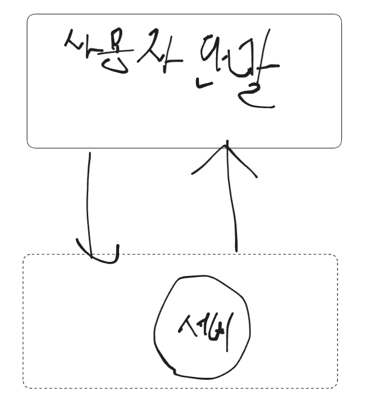
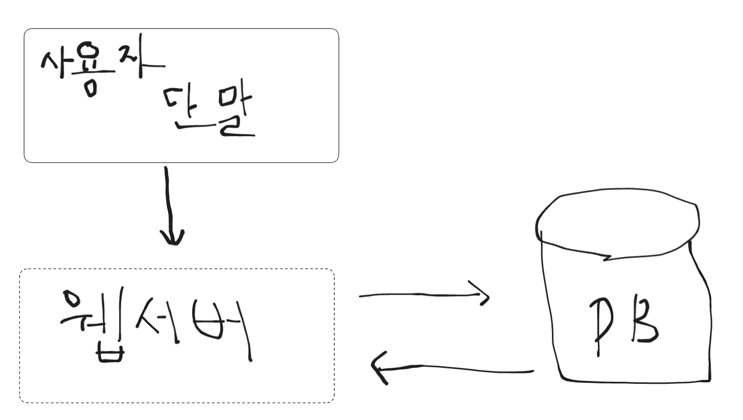

## 단일 서버
- 인원이 소규모일때는 괜찮을 수 있다 생각한다.
- 하지만 트래픽이 과도하게 들어가는 경우 어떻게 되어질까?
- 

## 데이터베이스
- 단일 서버라고 해도 데이터베이스가 존재하지 않으면 의미가 없다.
  - 물론 메모리로 저장하는 방법도 있긴하다. 
    - 공유 메모리 ex) Map<Long, Restaurant>
      - 여러 쓰레드에서 동시에 접근 가능 
      - 동시성 문제가 발생할 수 있음 → **ConcurrentHashMap** 같은 걸로 보완 가능
    - 쓰레드 로컬(독립된 저장소)
    - 데이터베이스 관점이라면 데이터는 공유가 되어야 한다라는 사실을 생각해보면 
      쓰레드 로컬 보다는 공유 메모리를 통해 데이터를 저장을 해야 한다.
- 어떤 데이터베이스를 사용을 해야 할까?
    - RDBMS
      - 데이터가 자주 변경이 이뤄지는 시스템에 적합하다. -> 스키마라는 명확한 구조가 존재하기 때문..
      - 영구적으로 저장할때 좋음
    - Nosql
      - **키-값 저장소**
        - 주요 특징
          - 단순성: 가장 기본적인 NoSQL 형태이며, 구현이 쉽고 빠르게 시작할 수 있습니다. 
          - 수평적 확장: 여러 서버에 데이터를 분산하여 저장하고, 필요에 따라 서버를 추가하여 시스템 확장 가능합니다. 
          - 속도: 키를 기반으로 데이터를 검색하기 때문에 빠른 속도로 데이터를 접근할 수 있습니다. 
          - 간단한 API: 복잡한 쿼리 없이도 데이터를 저장하고 검색할 수 있습니다. 
          - 스키마 없음: 특정 데이터 구조를 지정하지 않아도 됩니다.
          
        - 대표적인 키-값 저장소
          - Redis:
            - 높은 성능과 다양한 데이터 구조를 지원하여 세션 관리, **캐싱**, **메시지 브로커** 등에 사용됩니다.
          - DynamoDB:
            - Amazon Web Services (AWS)의 NoSQL 데이터베이스로, **대규모 데이터** 저장 및 관리에 적합합니다.
          - Couchbase:
            - Couchbase의 NoSQL 데이터베이스로, **클라우드**, **모바일**, **AI 애플리케이션**에 적합합니다.
            
        - 사용 사례:
          - 세션 관리: 웹 애플리케이션에서 사용자 세션 정보를 저장하고 관리합니다.
          - 캐싱: 웹 서버에서 자주 사용되는 데이터를 캐싱하여 응답 속도를 향상시킵니다.
          - 메시지 브로커: 애플리케이션 간에 메시지를 주고받는 시스템을 구축합니다.
          - 대량 데이터 저장: 소셜 미디어, 게임, 이커머스 등에서 대량의 데이터를 저장하고 관리합니다.
  
      - **그래프 저장소**
        - 주요 특징 
          - 데이터 관계 중심: 그래프 데이터베이스는 데이터 간의 관계를 중심으로 데이터를 저장하고, 이를 활용하여 복잡한 관계를 효율적으로 관리합니다.
          - 노드와 에지: 데이터는 노드(엔터티)와 에지(관계)로 구성됩니다. 노드는 개체를 나타내고, 에지는 노드 간의 관계를 나타냅니다.
          - 비정형 데이터 저장: NoSQL 데이터베이스는 비정형 데이터를 저장하는 데 용이하며, 그래프 데이터베이스는 특히 데이터 간의 복잡한 관계를 효율적으로 저장하고 관리하는 데 강점을 가지고 있습니다.
          - 데이터 구조의 유연성: 그래프 데이터베이스는 데이터 구조를 미리 정의할 필요가 없으며, 시간이 지나도 언제든지 변경할 수 있습니다.
            
          - 그래프 데이터베이스의 활용
            - 소셜 네트워크: 사용자 간의 관계, 친구 목록 등을 표현하는 데 사용됩니다.
            - 지식 그래프: 특정 분야의 지식과 관계를 모델링하는 데 사용됩니다.
            - 추천 시스템: 사용자의 취향이나 상품 간의 관계를 기반으로 추천을 제공하는 데 사용됩니다.
            - 사기 탐지: 사기 행위를 감지하기 위해 데이터 간의 관계를 분석하는 데 사용됩니다.
          
          - 대표적인 그래프 데이터베이스
            - Neo4j: 대표적인 오픈소스 그래프 데이터베이스입니다.
            - InfiniteGraph: 또 다른 대표적인 그래프 데이터베이스입니다.
            - Amazon Neptune: AWS 클라우드에서 제공하는 그래프 데이터베이스로, 다양한 그래프 데이터베이스 표준을 지원합니다.
            
          - NoSQL 그래프 저장소의 장점
            - 데이터 관계 표현: 복잡한 데이터 관계를 효율적으로 표현할 수 있습니다.
            - 데이터 탐색: 그래프 구조를 통해 데이터를 효율적으로 탐색할 수 있습니다.
            - 유연성: 데이터 구조를 미리 정의할 필요가 없으며, 언제든지 변경할 수 있습니다.
            - 성능: 데이터 관계가 복잡한 경우 관계형 데이터베이스보다 성능이 우수할 수 있습니다.
            
          - 참고
            - NoSQL 그래프 저장소는 관계형 데이터베이스에 비해 데이터 구조의 유연성과 복잡한 관계 검색 성능에 강점이 있습니다.
            - 데이터 모델과 쿼리 방식에 따라 성능 차이가 있을 수 있으므로, 애플리케이션의 특성에 맞는 데이터베이스를 선택하는 것이 중요합니다.
            - 그래프 데이터베이스는 데이터의 관계를 명확하게 표현하여, 소셜 네트워크 분석, 추천 시스템, 지식 그래프 구축 등 다양한 분야에서 활용되고 있습니다.
            
      - **칼럼 저장소**
        - 주요 특징
          - 컬럼 패밀리 
            - 데이터는 컬럼 패밀리라는 그룹으로 묶여 저장됩니다. 
            - 각 컬럼 패밀리는 고유한 열 이름을 가지고 있으며, 열의 데이터 유형이나 값이 다를 수 있습니다.
            
          - 유연한 스키마
            - NoSQL 컬럼 저장소는 스키마가 없는 경우가 많아, 데이터를 자유롭게 저장할 수 있습니다. 
            - 이는 데이터의 구조가 변경될 때 데이터베이스의 구조를 변경할 필요가 없다는 것을 의미합니다.
            
        - 성능
          - 특정 열에 대한 쿼리 성능을 향상시키고, 대규모 데이터 저장에 적합합니다.
          
        - 대표적인 예
          - **Apache Cassandra**와 **Bigtable**는 NoSQL 컬럼 저장소의 대표적인 예입니다.
          
        - NoSQL 컬럼 저장소의 장점
          - 성능: 특정 열에 대한 쿼리 성능을 향상시킬 수 있습니다.
          - 유연성: 스키마가 없거나 유연한 스키마를 제공하여 데이터 구조 변경에 유연하게 대처할 수 있습니다.
          - 확장성: 수직 및 수평 확장성이 좋아서 대규모 데이터 저장 및 처리 시스템에 적합합니다.
          - 빅 데이터: 빅 데이터 분석 및 저장에 적합합니다.
          
        - NoSQL 컬럼 저장소의 단점
          - 복잡성: 데이터 구조와 관리 방식이 복잡할 수 있습니다.
          - 스키마 관리: 스키마가 없거나 유연한 스키마를 갖는 경우 데이터 구조 관리에 어려움을 겪을 수 있습니다.
          - RDBMS와의 호환성: RDBMS와는 호환성이 낮을 수 있습니다.
          
      - **문서 저장소**
        - 주요 특징
          - 문서 형식: JSON, XML, BSON 등 다양한 형식으로 데이터를 저장합니다.
          - 스키마 유연성: 스키마를 미리 정의하지 않아도 되고, 필요에 따라 변경할 수 있습니다.
          - 반정형 데이터 처리: 비정형 또는 반정형 데이터를 효율적으로 저장하고 관리할 수 있습니다.
          - 고성능: 특정 데이터 액세스 패턴에 최적화되어 있어 높은 성능을 제공할 수 있습니다.
          - 확장성:서버 추가를 통한 확장 대신 상용 하드웨어를 활용하여 확장할 수 있습니다.
        
        - NoSQL 문서 저장소의 예
          - MongoDB: JSON 형식으로 데이터를 저장하는 대표적인 NoSQL 문서 저장소입니다.
          - Amazon DynamoDB: NoSQL 데이터베이스 서비스로, 문서 형태로 데이터를 저장하고 쿼리할 수 있습니다.
          - Apache Cassandra: 분산형 NoSQL 데이터베이스로, 문서 및 키-값 형태로 데이터를 저장할 수 있습니다.
          - Elasticsearch: 검색 및 분석을 위한 NoSQL 문서 저장소로, JSON 문서 형태로 데이터를 저장하고 검색합니다.
          
        - NoSQL 문서 저장소의 장점
          - 유연성: 스키마를 미리 정의하지 않아도 되고, 데이터 구조를 변경하기 쉽습니다.
          - 확장성: 분산된 환경에서 확장하기 쉽고, 수평적 확장도 가능합니다.
          - 고성능: 특정 데이터 액세스 패턴에 최적화되어 있어 빠른 속도로 데이터를 처리할 수 있습니다.
          - 성능: NoSQL 데이터베이스는 특정 형태의 데이터 액세스 패턴에 최적화되어 있어 뛰어난 성능을 제공할 수 있습니다.
        
        - NoSQL 문서 저장소의 단점:
          - 트랜잭션: ACID 트랜잭션을 지원하지 않아 데이터 일관성을 유지하기 어려울 수 있습니다.
          - 쿼리: SQL 기반 데이터베이스에 비해 복잡한 쿼리를 작성하기 어려울 수 있습니다.
          - 데이터 일관성: 데이터 일관성을 유지하기 위한 추가적인 노력이 필요할 수 있습니다.
        
        - NoSQL 문서 저장소의 활용 사례:
          - 소셜 네트워크: 사용자 프로필, 게시물, 댓글 등 비정형 데이터를 저장하는 데 적합합니다.
          - 콘텐츠 관리 시스템: 문서, 이미지, 비디오 등 다양한 형태의 콘텐츠를 관리하는 데 적합합니다.
          - 빅 데이터 분석: 대규모 데이터를 저장하고 분석하는 데 적합합니다.
          - IoT (사물 인터넷): 센서 데이터, 장치 정보 등 다양한 형태의 데이터를 저장하고 관리하는 데 적합합니다.
          - 모바일 애플리케이션:동적으로 변하는 데이터를 저장하고 관리하는 데 적합합니다.
        
      - 합당한 경우
        - 아주 낮은 응답 지연시간
        - 다루는 데이터가 비정형이라 관계형 데이터가 아님
        - 데이터(JSON,YAML,XML등)를 직렬화하거나 역직렬화할 수 있기만 하면 된다.
        - 아주 많은 양의 데이터를 저장할 수 있음
        
    - 수직적 규모 확장
      - 트래픽 양이 적을때 효과적
      - CPU나 메모리를 무한대로 증설할 방법이 없다.
      - 장애에 대한 자동복구 방법이나 다중화 방안을 제시하지 않는다.
        - 발생시 서바는 완전히 죽는다.
      - 수평적 규모 확장
        - 웹 서버가 다운되면 사용자는 웹 사이트에 접속 불가 -> 서버 한계 -> 부하분산 or 로드벨런서 도입이 최선
        - 로드벨런서
          - 부하 분산 집합에 속한 웹 서버들에게 트레픽 부하를 고르게 분산하는 역할을 한다.
          - 웹 계층은 로드벨런서로 처리한다고 하지만 데이터 계층은 불가능하다.
          - 사용자가 많은거와 그 사용자들이 생성한 데이터는 다른 의미다.
        - 데이터베이스 다중화
          1) 성능이 좋아짐 -> 주-부 다중화 모델에서 
             - 변경 연산은 주 데이터베이스 서버로만 전달  
             - 읽기 연산은 부 데이터베이스 서버들로 분산 
             - _병렬로 처리될수 있는 질의 수가 늘어나므로 성능이 좋아진다._
          2) 안정성(reliability) 
             - 데이터베이스 서버 가운데 일부가 파괴되어도 데이터는 보존된다. 
          3) 가용성(availability)
             - 하나의 데이터베이스 서버에 장애가 발생하더라도 다른 서버에 있는 데이터를 가져와 계속 서비스할 수 있다.
          데이터베이스 다중화 종류?
             1) **클러스터링 (Clustering)** 은 여러 개의 DB 서버를 마치 하나의 서버처럼 동작시켜 부하 분산 및 고가용성을 확보하는 방법
             2) **레플리케이션 (Replication)** 은 DB 서버와 저장소를 포함한 시스템 전체를 복제하여 데이터 손실 방지 및 복구에 활용하는 방법
    
  - 
  
 로드벨런서로 요청을 제어하고 데이터베이스 다중화로 서비스가 정상적으로 동작을 시키게 만들었다면 이제 응답시간을 개선하는 
 작업을 가질 수 있을거 같다.
 - 응답 시간 -> 캐시
 - 정적 콘텐츠를 콘테츠 네트워크로 옮기면 개선 할 수 있다. -> CDN

## 캐시
 - 값비싼 연산 결과 또는 자주 참조되는 데이터를 메모리안에 두고, 뒤이은 요청이 보다 빨리 처리될 수 있도록 하는 저장소
 - 캐시 계층은 데이터가 잠시 보관되는 곳으로 데이터베이스보다 훨씬 빠르다.
   - 별도의 캐시 계층을 두면, **성능이 개선될 뿐만 아니라** **데이터베이스의 부하를 줄일 수 있고**, 캐시 계층의 규모를 독립적으로 확장하는것도 가능해진다.
 - 캐시 전략
   - 읽기 전략
     1) Lock Aside == Cache Aside
       - 데이터를 찾을때 **우선 캐시에 저장된 데이터가 있는지 우선적으로 확인하는 전략**. 
       - 만일 캐시에 데이터가 없으면 DB에서 조회함.
       - 반복적인 읽기가 많은 호출에 적합.
       - 캐시와 DB가 분리되어 가용되기 때문에 원하는 데이터만 별도로 구성하여 캐시에 저장
         -  캐시와 DB가 분리되어 가용되기 때문에 캐시 장애 대비 구성이 되어있음.
          만일 redis가 다운 되더라도 DB에서 데이터를 가져올수 있어 서비스 자체는 문제가 없음.
         - 대신에 캐시에 붙어있던 connection이 많았다면, redis가 다운된 순간 순간적으로 DB로 몰려서 부하 발생.
       - Cache Store와 Data Store(DB)간 정합성 유지 문제가 발생할 수 있으며, 
       - 초기 조회 시 무조건 Data Store를 호출 해야 하므로 단건 호출 빈도가 높은 서비스에 적합하지 않다. 
       - 대신 반복적으로 동일 쿼리를 수행하는 서비스에 적합한 아키텍처
       - Cache Warming: DB에서 데이터를 미리 넣어주는 작업    
     2) Read Through 패턴
       - _캐시에서만 데이터를 읽어오는 전략_ (inline cache)
       - Look Aside 와 비슷하지만 데이터 동기화를 라이브러리 또는 캐시 제공자에게 위임하는 방식이라는 차이가 있음.
         - 따라서 데이터를 조회하는데 있어 전체적으로 속도가 느림.
       - 또한 데이터 조회를 전적으로 캐시에만 의지하므로, redis가 다운될 경우 서비스 이용에 차질이 생길수 있음.
       - 대신에 캐시와 DB간의 데이터 동기화가 항상 이루어져 데이터 정합성 문제에서 벗어날수 있음
       - 역시 읽기가 많은 워크로드에 적합
     - Read Through 방식은 Cache Aside 방식과 비슷하지만, 
       **Cache Store에 저장하는 주체가 Server이냐 또는 Data Store 자체** 이냐에서 차이점이 있다.
     - 이 방식은 직접적인 데이터베이스 접근을 최소화하고 Read 에 대한 소모되는 자원을 최소화할 수 있다.
     - 하지만 캐시에 문제가 발생하였을 경우 이는 바로 서비스 전체 중단으로 빠질 수 있다. 
     - 그렇기 때문에 redis과 같은 구성 요소를 Replication 또는 Cluster로 구성하여 가용성을 높여야 한다.

   - 쓰기 전략
 - 유의 사항
   - 어떤 데이터를 두어야 하는가?
     - 중요데이터는 여전히 지속적 저장소에 둬야한다. ex) RDBMS
   - 캐시에 보괸된 데이터는 어떻게 만료가 되는가?
     - 너무 짧은 경우: 데이터베이스를 자주 읽는다.
     - 너무 긴 경우 : 원본과 차이가 많이날 가능성이 높다.
   - 일관성은 어떻게 유지되는가?
     - 일관성은 데이터 저장소의 원본과 캐시 내의 사본이 같은지 여부
   - 장애에는 어떻게 대체할 것인가?
     - 한 대만 두는 경우 단일 장애 지점이 되어버릴 가능성이 높다.
       - 단일 장애 지점: 위키피디아 "어떤 특정 지점에서의 장애가 전체 시스템의 동작을 중단시켜버릴 수 있는 경우, 우리는 해당 지점을 단일 장애 지점이라고 부른다."
     - SPOF를 피하려면 여러 지역에 걸쳐 캐시 서버를 분산 시켜야 한다.
   - 캐시 메모리는 얼마나 크게 잡을 것인가?
     - 너무 작으면, 액세스 패턴에 따러서는 데이터가 너무 자주 캐시에서 밀려나버려 캐시의 성능이 떨어지게 된다.
     - 캐시 메모리 과할당?
       - 캐시에 보관될 데이터가 갑자기 늘어났을 때 생길 문제도 방지할 수 있게 된다. 
   - 데이터 방출정책은 무엇인가?
     - 캐시가 꽉차버리면 추가로 캐시에 데이터를 넣어야 할 경우 기존 데이터를 내보내야 한다.
     - 캐시 데이터 방출 정책
       - LRU: 마지막으로 사용된 시점이 가장 오래된 데이터를 내보내는 정책
       - LFU: 사용된 빈도가 가장 낮은 데이터를 내보내는 정책
       - FIFO: 가장 먼저 캐시에 들어온 데이터를 가장 먼저 내보내는 정책
       
## 콘텐츠 전송 네트워크(CDN)
  - 지리적으로 분산된 서버의 네트워크
  - 이미지,비디오,CSS,Javascript 파일 등을 캐시할 수 있다.
  - 동적 콘텐츠 캐싱?
  - 고려사항
    - 비용
    - 적절한 만료 설정
      - 너무 길면 콘텐츠의 신선도 감소
      - 너무 짧으면 원본 서버에 빈번하게 접속 -> 좋지 않음
    - CDN 장애에 대한 발처 방안
      - 문제를 감지하여 원본 서버로 부터 직접 콘텐츠를 가져오도록 클라이언트를 구성하는것이 필요.
    - 콘텐츠 무효화
      - 아직 만료되지 않아도 CDN에서 제거할 수 있는 방법
        - CDN 서비스 사업가가 제공하는 API를 이용하는 콘텐츠 무효화
        - 콘텐츠의 새로운 버전을 지정하기 위해서는 URL마지막에 버전 번호를 인자로 준다.
        
## 무상태 웹 계층
  - **수평적 확장!!!**
  - 상태정보 (ex.사용자 세션)를 웹계층에서 제거해야 한다.
  - 바람직한 전략 -> 관계형 데이터베이스나 NOSQL 같은 지속성 저장소에 보관하고, 필요할때 가져온다.
  - 상태 vs 무상태
    - 상태: 상태 정보를 보관하는 서버는 클라이언트 정보, 즉 상태를 유지하여 요청들 사이에 공유되도록 한다.
    - 클라이언트로부의 요청은 항상 같은 서버로 전송되어야 한다.
      - 이를 지원하기 위해 고정세션이라는 기능을 제공하고 있다.
        - 로드벨런스에 부담 상승
        - 로드벨런서 뒷단에 서버를 추가하거나 제거도 어려워짐
          - -> 이들 서버의 장애 처리도 어려워짐
        - 고정 세션(Sticky Session):
          - 로드밸런싱이 잘 동작하지 않을 수 있다
          - 특정 서버만 과부하가 올 수 있다.
          - 특정 서버 Fail시 해당 서버에 붙어 있는 세션들이 소실될 수 있다.
    - 무상태: 상태를 공유 저장소로 저장한다.
      - 공유저장소는 관계형 데이터베이스일 수도 있고, 캐시 시스템일 수 도 있다.
      - 자동 규모확장은 트래픽 양에 따라 웹 서버를 자동으로 추가하거나 삭제하는 기능을 뜻한다.
      - 상태 정보가 웹 서버로부터 제거되었으므로ㅡ 트래픽 양에 따라 웹 서버를 넣거나 빼기만 하면 자동으로 규모를 확장할 수 있게 되었다.
가용성을 높이고 전 세계 어디서도 쾌적하게 사용할 수 있도록 하기 위해서는 여러 데이터 센터를 지원하는 것이 필수다.

## 데이터 센터
  - 지리적 라우팅: 장애가 없는 상황에서 사용자는 가장 가까운 데이터센터로 안내된다.
    - geoDNS: 사용자의 위치에 따라 도메인 이름을 어떤 IP 주소로 변환할지 결정할 수 있는 DNS서비스다. 
  시스템을 더 큰 규모로 확장하기 위해서는 시스템을 각 컴포넌트로 분리하여, 각기 독립적으로 확장될 수 있도록 하여애 한다.
    - 메시지 큐:실제 분산 시스템이 이문제를 풀기 위해 채용하고 있는 핵심 가치 

## 메시지 큐
  - 메시지의 무손실(durability, => 메시지 큐에 일단 보관된 메시지는 소비자가 꺼낼 때까지 안전한 보관되는 특성)을 보장하는 비동기 통신을 지원하는 컴포넌트
  - 기본 아키텍처
    - 생상자/발행자(producer/publisher) [입력서비스 -> 메시지 만들어서] --발행--> 큐 -> 소비자/구독자(consumer/subscriber) [서비스or 서버]
    - 서비스 혹은 서버간의 결합이 느슨해져서, 규모 확장성이 보장되어야 하는 안정적 애플리케이션을 구성하기 좋다.
      - 생산자는 소비자 프로세스가 다운되어 있어도 메시지를 발행 가능
      - 소비자는 생산자 서비스가 가용한 상태가 아니어도 메시지를 수신 가능
    - 큐의 크기가 커지면 더 많은 작업 프로세스를 추가해야 처리 시간을 줄일 수 있다.
    - 큐가 거의 항상 비어있는 상태라면, 작업 프로세스의 수는 줄일 수 있다.
  - 대표적인 메시지 큐의 종류 간략 정리 (레디스 pub/sub 이랑 이벤트 리스너는 참고로 작성 메시지 큐아님)
    - 아파치 카프카
      - 특징 
        1) 고속의 메시지 생산/소비가 필요한 시스템에서 안정적이고 확장 가능한 메시지 큐 역할을 수행 
        2) 기존 큐보다 더 유연하게 다수의 소비자가 병렬로 메시지를 처리할 수 있고, 데이터 유실 없이 재처리도 가능합니다.
    - 레빗 mq
      - 특징
        1) 신속하고 안정적인 메시지 전달이 필요한 상황에 적합한 메시지 큐 시스템
        2) 다양한 큐 패턴과 라우팅 기능을 지원하여 유연한 메시지 흐름 제어가 가능
    - 레디스 스트림
      - 특징
        1) Redis의 빠른 성능을 기반으로, 간단하면서도 유연한 메시지 큐 시스템을 제공
        2) Consumer Group을 통한 분산 소비와 재처리 기능이 있어 경량 이벤트 처리에 적합
    - 레디스 pub/sub
      - 특징
        1) Redis Pub/Sub은 실시간 브로드캐스트 도구이지, 메시지 큐는 아니다.
           -> 메시지 보존, 재처리, 신뢰성 전송이 필요하다면 → Redis Streams 또는 Kafka, RabbitMQ 사용이 적합합니다.
    - 스프링의 이벤트 리스너(메시지 큐는 아니지만 추가 작성)
      - 특징
        1) Spring @EventListener는 애플리케이션 내부에서 메시지를 전달하는 간단한 큐 역할을 할 수 있지만, 전통적인 메시지 큐 시스템은 X
        2) 비동기 처리와 관심사 분리에는 유용하지만, **메시지의 보존이나 시스템 간 통신이 필요하다면** 외부 메시지 큐(Kafka, RabbitMQ 등)를 사용하는 것이 적합합니다.

## 로그, 메트릭 그리고 자동화
  - 로그: 에러 로그를 모니터링은 중요
    - 시스템의 오류와 문제들을 보다 쉽게 찾을 수 있다.
    - 서버 단위로 모니터링 할 수 도 있지만, 로그를 단일 서비스로 모아주는 도구를 활용하면 편리하고 검색할 수 있다. 
  - 메트릭: 메트릭을 잘 수집하면 사업 현황에 관한 유용한 정보를 얻을 수 있고, 시스템의 현재 상태를 손쉽게 파악할 수 있다.
    - 호스트 단위 메트릭: CPU, 메모리, 디스크 I/O에 관한 메트릭이 여기에 해당
    - 종합(aggregated) 메트릭: 데이터베이스 계층의 성능, 캐시 계층의 성능 같은것이 여기에 해당
    - 자동화: 시스템이 크고 복잡해지면 생산성을 높이기 위해 자동화 도구 활용
      - 지속적 통합(CI): 개발자가 만드는 코드가 어떤 검증 절차를 자동으로 거치도록 할 수 있어서 문제를 감지할 수 있다.
        - 빌드, 테스트, 배포등의 절차를 자동화할 수 있어서 개발 생산성을 크게 향상 시킬 수 있다.

## 데이터베이스의 규모 확장
  - 데이터베이스의 규모를 확정하는 접근법 
    1) 수직적 규모 확장(스케일 업)
        - 기존 서버에 더 많은, 또는 고성능의 자원(CPU,RAM,디스크)을 증설하는 방법
          - 무한 증설 불가능 - 사용자가 늘어나는 속도가 빠를까 서버의 성능을 올리는 속도가 빠를까..
          - SPOF로 인한 위험성
          - 비용 상승 / 고성능 서버로 갈 수록 가격이 올라간다.
          
    2) 수평적 규모 확장(샤딩)
       - 더 많은 서버를 추가함으로써 성능을 향상시킬 수 있다.
       - 대규모 데이터베이스를 샤드라고 부르는 작은 단위로 분할하는 기술을 일컫는다.
         - 모든 샤드는 같은 스키마를 쓰지만 샤드에 보관되는 데이터 사이에는 중복이 없다.
       - 샤딩 키를 어떻게 정할까?
         - 파티션 키라고 불리며 데이터가 어떻게 분산될지 정하는 하나 이상의 칼럼으로 구성된다.
         - 시스템이 복잡해지고 풀어야 할 새로운 문제도 생긴다.
           - 데이터의 재 샤딩: 
             - 정의) 
               - 데이터가 너무 많아져서 하나의 사드로는 더 이상 감당하기 어려울 때
               - 샤드 소진(shard exhaustion): 샤드 간 데이터 분포가 균등하지 못하여 어떤 샤드에 할당된 공간 소모가 다른 샤드에 비해 빨리 진행될 때
                 - 안정 캐시 기법을 활용하면 이 문제를 해결할 수 있다. [5장으로]()
           - 유명인사(celebrity == hotspot key)
             - 특정 샤드에 질의가 집중되어 서버에 과부하가 걸리는 문제
             - 해결방법: 유명인사 각각에 사드 하나씩을 할당해야 할 수 도 있고, 심지어는 더 잘게 쪼개야 할수 도 있다...(확실한 방법은 아닌듯)
           - 조인과 비정규화
             - 일단 하나의 데이터베이스를 여러 샤드 서버로 쪼개고 나면, 여러 샤드에 걸친 데이터를 조인하기 힘들어진다.
             - 데이터베이스를 비정규화하여 하나의 테이블에서 질의가 수행될 구 있도록 하는것(한 가지 방법이라고 말한거 봐서는 더 있을수도 있겠다..)
             
## 백만 사용자,그리고 그 이상
   - 시스템의 규모를 확장하는 것은 지속적이고 반복적인 과정이다.
   - 수백만 사용자 이상을 지원하려면 새로운 전략 도입이 필요하다.    

### 참고 문헌
- https://en.wikipedia.org/wiki/HTTP
- https://blog.teamtreehouse.com/should-you-go-beyond-relational-databases
- https://en.wikipedia.org/wiki/Replication_(computing)
- https://en.wikipedia.org/wiki/Multi-master_repli_cation
- https://codeahoy.com/2017/08/11/caching-strategies-and-how-to-choose-the-right-one/
- https://en.wikipedia.org/wiki/Single_point_of_failure
- https://aws.amazon.com/ko/cloudfront/dynamic-content/
- https://netflixtechblog.com/active-active-for-multi-regional-resiliency-c47719f6685b
- https://aws.amazon.com/ko/ec2/instance-types/high-memory/
- https://nickcraver.com/blog/2013/11/22/what-it-takes-to-run-stack-overflow/
- https://inpa.tistory.com/entry/REDIS-%F0%9F%93%9A-%EC%BA%90%EC%8B%9CCache-%EC%84%A4%EA%B3%84-%EC%A0%84%EB%9E%B5-%EC%A7%80%EC%B9%A8-%EC%B4%9D%EC%A0%95%EB%A6%AC#%EC%BA%90%EC%8B%9C_%EC%9D%BD%EA%B8%B0_%EC%A0%84%EB%9E%B5_read_cache_strategy
