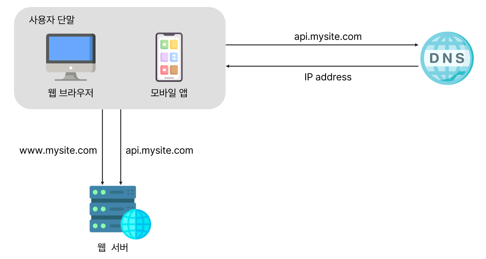
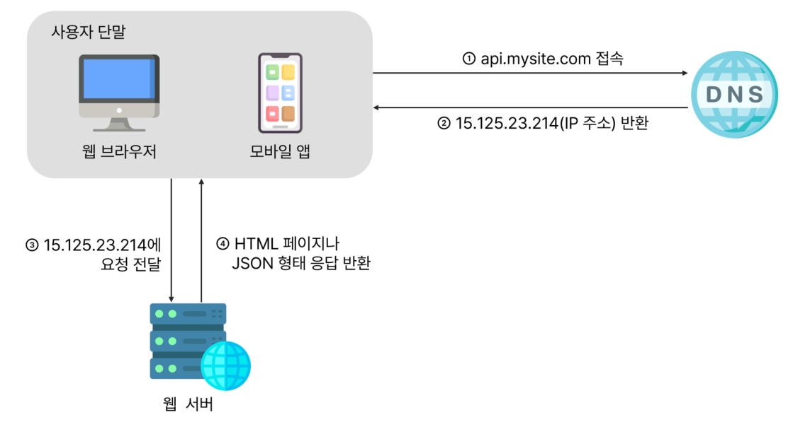
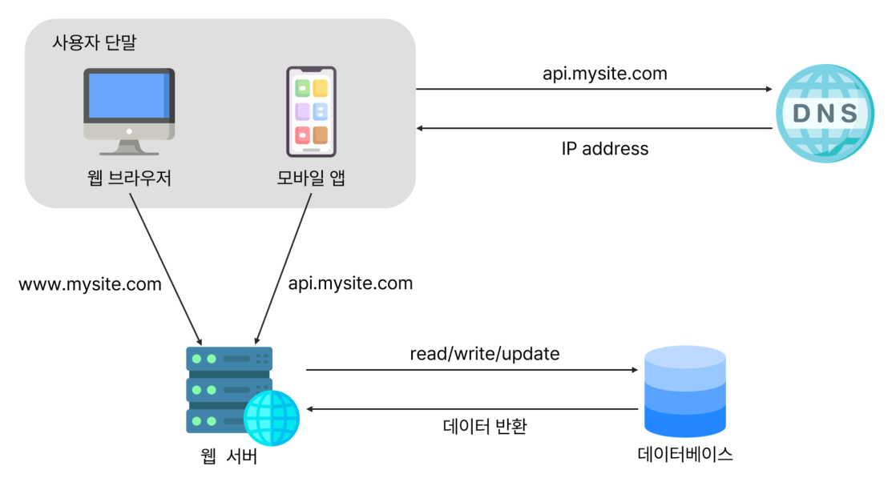
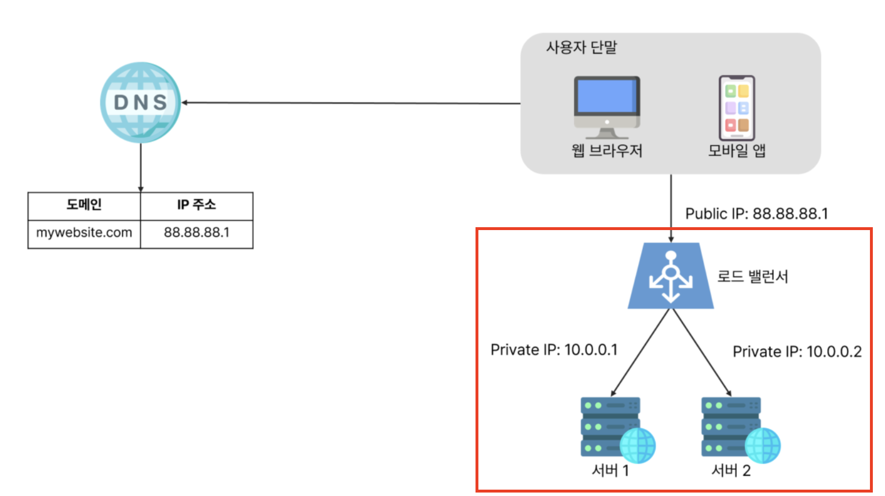
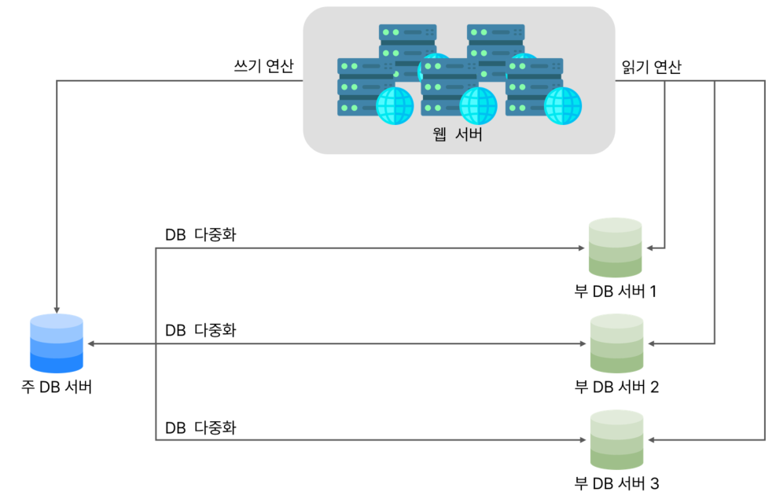
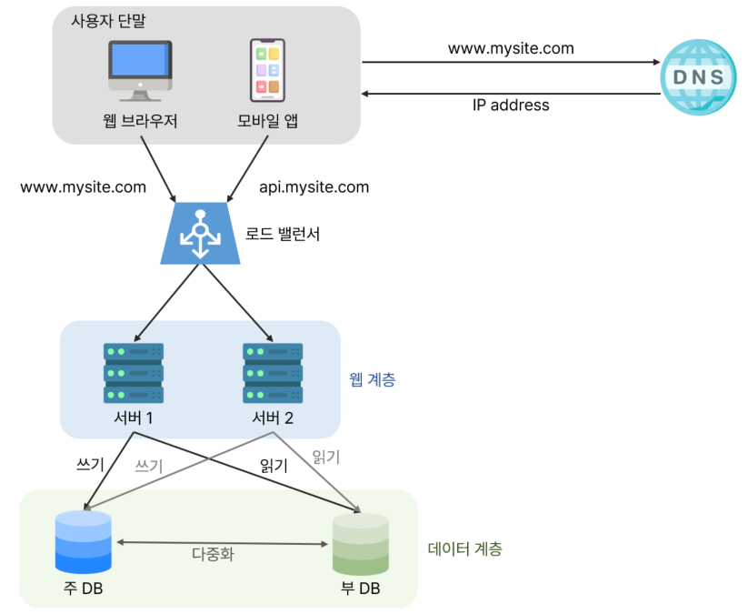
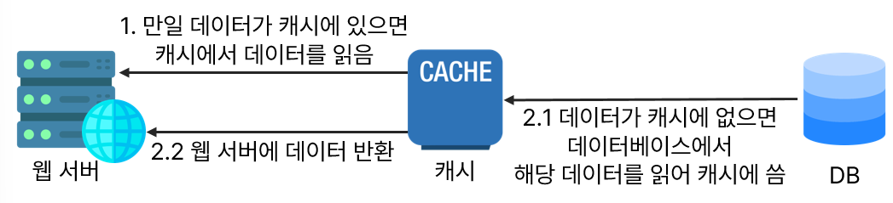
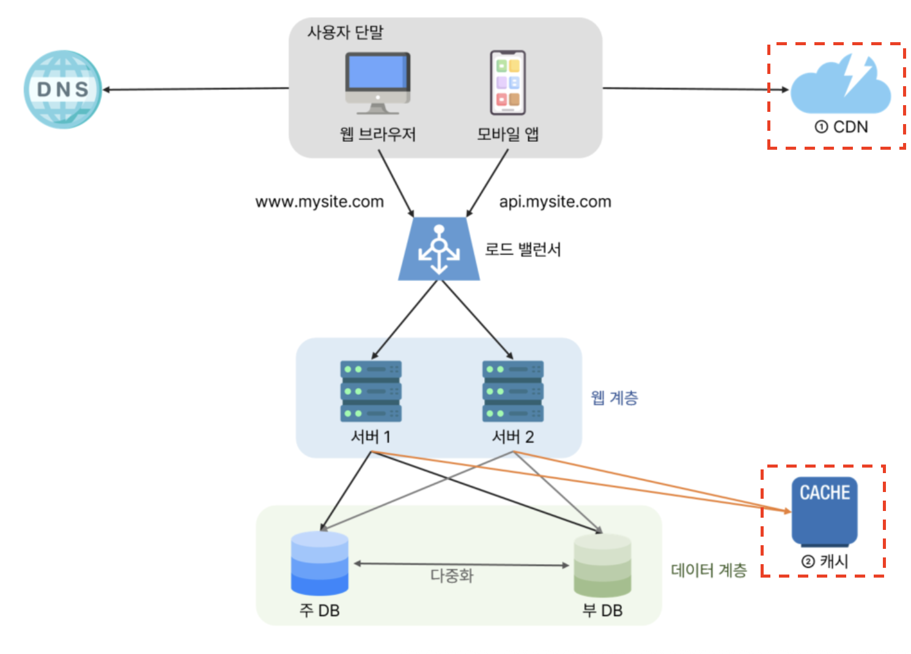
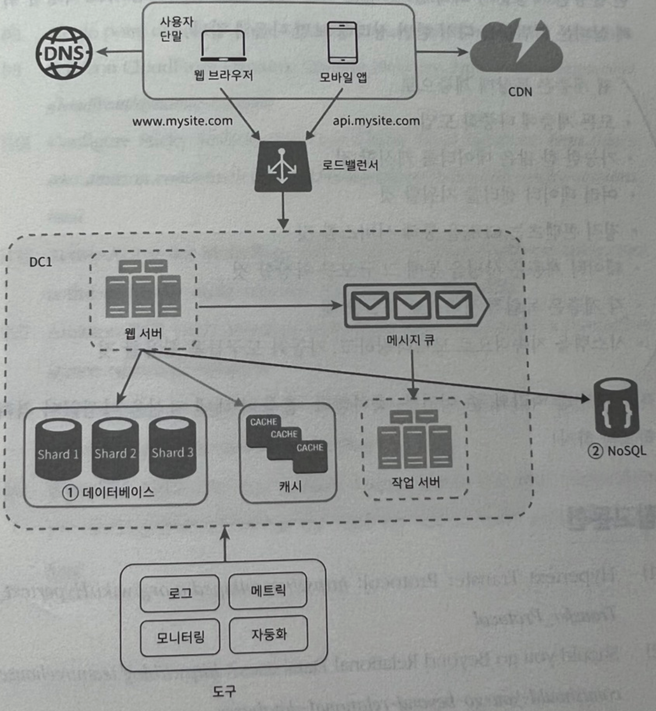

## 단일 서버
처음에는 단 한 대의 서버에서 실행되는 간단한 시스템부터 설계해 본다.
웹, 앱, 데이터베이스, 캐시 등이 전부 서버 한 대에서 실행되는 구조이다.

1. 사용자는 api.mysite.com 같은 도메인 이름으로 접속한다.
   접속을 위해 도메인 이름 서비스(DNS)를 통해 IP 주소로 변환해야 한다. DNS는 보통 제3 사업자(third party)가 제공하는 유료 서비스를 이용하며, 시스템 내부 요소는 아니다.

2. DNS 조회 결과로 웹 서버의 IP 주소가 반환된다.
3. 해당 IP 주소로 HTTP 요청이 전달된다.
4. 웹 서버는 요청을 처리하여 HTML 페이지나 JSON 응답을 반환한다.

## 데이터베이스 분리
사용자 수가 늘어나면 서버 한 대로는 부족하다.
따라서 `웹/모바일 트래픽 처리 서버(웹 계층`)와 `데이터베이스 서버(데이터 계층)`를 분리하여 독립적으로 확장할 수 있게 한다.

### 어떤 데이터베이스를 선택할까?
관계형 데이터베이스(RDB)와 비관계형 데이터베이스(NoSQL)의 차이는 다음과 같다.

#### 1. 관계형 데이터베이스
자료를 테이블과 열, 칼럼으로 표현한다. 여러 테이블에 있는 데이터를 그 관계에 따라 join하여 합칠 수 있다.

#### 2. 비관계형 데이터베이스
CouchDB, Neo4j, MongoDB, Amazon DyamoDB 등이 있다.
다음 네 부류로 나뉜다.
- 키-값 저장소(key-value store)
- 그래프 저장소(graph store)
- 칼럼 저장소(column store)
- 문서 저장소(document store)

비 관계형 데이터베이스는 **일반적으로 조인 연산을 지원하지 않는다.

대부분의 상황에서는 관계형 데이터베이스가 최선이지만, 아래의 경우 비관계형 데이터베이스도 고려할 수 있다. [[NoSQL|참고]]

- 매우 낮은 응답 지연시간(latency)이 요구될 때
- 다루는 데이터가 비정형(unstructured)이라 관계형 데이터가 아닐 때
- 데이터(JSON, YAML, XML 등)를 직렬화하거나 역직렬화 할 수 있기만 하면 될 때
- 아주 많은 양의 데이터를 저장해야 할 때(빅데이터)
- ex) SNS 친구 관계 및 피드 데이터

## 수직적 규모 확장 vs 수평적 규모 확장
| **구분**             | **설명**                         |
| ------------------ | ------------------------------ |
| 수직적 확장 (Scale Up)  | 한 대의 서버 CPU, RAM 같은 사양을 높이는 방식 |
| 수평적 확장 (Scale Out) | 서버의 대수를 추가하여 성능을 개선하는 방식       |

### 수직적 확장의 단점
수직적 확장은 초기 트래픽이 적을 때 단순한 방법이지만 치명적인 단점이 있다.
1. 한 대의 서버에 CPU나 메모리를 무한대로 증설하는 데에는 한계가 있다.
2. 수직적 규모 확장법은 장애에 대한 자동복구(failover) 방안이라 다중화 방안을 제시하지 않는다.
   서버에 장애가 발생하면 웹사이트/앱은 완전히 중단된다.

따라서 대규모 애플리케이션에는 수평적 확장이 적합하다.

### 로드 밸런서
위 처럼 웹 서버가 직접 클라이언트 요청을 처리하는 설계에는 몇 가지 문제가 있다.

- 웹 서버가 다운되면 사용자는 웹 사이트에 접속할 수 없다.
- 너무 많은 사용자가 접속하여 웹 서버가 한계 상황에 도달하게 되면 응답 속도가 느려지거나 서버 접속이 불가능해질 수도 있다.

이를 해결하려면 부하 분산기 또는 로드밸런서를 도입하는 것이 최선이다.

로드밸런서는 부하 분산 집합에 속한 웹 서버들에게 트래픽 부하를 고르게 분산하는 역할을 한다.

위 그림을 보면 사용자는 로드밸런서의 `공개 IP 주소(public IP address)`로 접속한다.
따라서 웹 서버는 클라이언트의 접속을 직접 처리하지 않는다.

더 나은 보안을 위해, 서버 간 통신에는 `사설 IP 주소(private IP address)`가 이용되며, 로드밸런서는 웹 서버와 통신하기 위해 바로 이 사설 주소를 이용한다.
사설 IP 주소는 **같은 네트워크에 속한 서버 사이의 통신에만 쓰일 수 있는 IP 주소**로, **인터넷을 통해서는 접속할 수 없다.**

그림에 나온 대로 부하 분산 집합에 또 하나의 웹 서버를 추가하고 나면 장애를 자동복구하지 못하는 문제는 해소되며, 웹 계층의 가용성은 향상된다.

이게 무슨 말일까? 🤔

- 서버 1이 다운되면(offline) 모든 트래픽은 서버 2로 전송되므로 **웹 사이트 전체가 다운되는 일이 방지**된다. 부하를 나누기 위해 새로운 서버를 추가할 수도 있다.
- 웹사이트로 유입되는 트래픽이 가파르게 증가하면 두 대의 서버로 **트래픽을 감당할 수 없는 시점**이 오는데, **로드밸런서가 있으므로 걱정하지 않아도 된다.** 웹 서버 계층에 더 많은 **서버를 추가**하기만 하면 **로드밸런스가 자동적으로 트래픽을 분산**하기 시작할 것이다.

### 데이터베이스 다중화
웹 계층은 이제 안정적이지만,  데이터베이스가 하나라면 장애 발생 시 위험하다.
따라서 `주-부 다중화(Master-Slave Replication)`를 적용한다.

> **_"많은 데이터베이스 관리 시스템이 다중화를 지원한다. 보통은 서버 사이에 주(master)-부(slave) 관계를 설정하고 데이터 원본은 주 서버에, 사본은 부 서버에 저장하는 방식이다."_** - 위키피디아

- 쓰기 연산(write operation)은 마스터(주 데이터베이스)에서만 지원한다.
- 부 데이터베이스는 주 데이터베이스로부터 그 사본을 전달받으며, 읽기 연산(read operation)만을 지원한다.
- 데이터베이스를 변경하는 명령어들(`insert`, `delete`, `update` 등)은 주 데이터베이스로만 전달되어야 한다.

### 데이터베이스 다중화의 장점
- `더 나은 성능`: 주-부 다중화 모델에서 모든 데이터 변경 연산은 주 데이터베이스 서버로만 전달되는 반면 읽기 연산은 부 데이터베이스 서버들로 분산된다. 병렬로 처리될 수 있는 질의(query) 수가 늘어나므로, 성능이 좋아진다.
- `안정성(reliability)`: 데이터를 지역적으로 떨어진 여러 장소에 다중화시켜 놓을 수 있기 때문에, 자연 재해 등의 이유로 데이터베이스 서버 가운데 일부가 파괴되어도 데이터는 보존될 것이다.
- `가용성(availability)`: 데이터를 여러 지역에 복제해 둠으로써, 하나의 데이터베이스 서버에 장애가 발생하더라도 다른 서버에 있는 데이터를 가져와 계속 서비스할 수 있게 된다.

### 장애 상황별 동작
이때!
만약 다중화된 데이터베이스 서버 중 하나가 다운되면 무슨 일이 벌어질까?

| **상황**            | **동작**                                 |
| ----------------- | -------------------------------------- |
| 부 서버 1대 다운        | 읽기 연산은 주 서버로 이동, 새 부 서버가 장애 서버를 대체     |
| 부 서버 여러 대 중 1대 다운 | 읽기 연산은 나머지 부 서버로 분산, 새 부 서버가 장애 서버를 대체 |
| 주 서버 다운 (부 서버 1대) | 부 서버가 새로운 주 서버로 승격, 새 부 서버 추가 필요       |
`프로덕션(production) 환경`에서 벌어지는 일은 이것보다는 사실 더 복잡한데, 부 서버에 보관된 데이터가 최신 상태가 아닐 수 있기 때문이다.
없는 데이터는 `복구 스크립트(recovery script)`를 돌려서 추가해야 한다.

다중 마스터나, 원형 다중화 방식을 도입하면 도움이 될 수 있지만, 훨씬 복잡하며 이 책에서 다룰 수 있는 범위를 넘어선다.

#### 로드밸런서 + 데이터베이스 다중화를 고려한 최종 설계

이 설계는 다음과 같이 동작한다.

- 사용자는 DNS로부터 로드밸런서의 공개 IP 주소를 받는다.
- 해당 IP 주소로 로드밸런서에 접속한다.
- HTTP 요청은 서버 1이나 서버 2로 전달된다.
- 웹 서버는 부 데이터베이스에서 데이터를 읽고,
- 데이터 추가, 삭제, 갱신 같은 변경 연산은 주 데이터베이스로 전달한다.

## 캐시
웹 계층과 데이터 계층을 넘어, 시스템의 응답 시간(latency)을 개선하려면 **캐시**를 도입하는 것이 중요하다.
응답 시간은 `캐시(cache)`를 붙이고 정적 컨텐츠를 `콘텐츠 전송 네트워크(CDN)`로 옮기면 개선할 수 있다.

캐시는 `값비싼 연산 결과` 또는 `자주 참조되는 데이터`를 메모리 보관해,  뒤이은 요청을 더 빠르게 처리할 수 있도록 돕는 저장소이다.

위 설계에서는, 사용자가 웹 페이지를 새로고침할 때마다 데이터를 가져오기 위해 데이터베이스를 계속 호출한다.
애플리케이션의 성능은 **데이터베이스를 얼마나 자주 호출하느냐**에 크게 좌우되는데, **캐시**는 그런 문제를 완화할 수 있다.

### 캐시 계층(cache tier)
캐시 계층은 데이터가 잠시 보관되는 곳으로, 데이터베이스보다 훨씬 빠르다.
별도의 캐시 계층을 두면 성능이 개선될 뿐만 아니라 데이터베이스의 부하를 줄이고, 캐시만 독립적으로 확장시키는 것도 가능하다.

#### 캐싱 전략
캐시 서버를 두었을 때 일반적인 처리 흐름은 다음과 같다.

1. 웹 서버는 우선 캐시에 데이터가 있는지 검사한다.
2. 데이터가 캐시에 있다면 해당 데이터를 클라이언트에 바로 반환한다.
3. 데이터가 없다면 데이터베이스에서 조회한 뒤 캐시에 저장하고 클라이언트에 반환한다.

> 이러한 캐시 전략을 캐시 우선 읽기 전략(read-through caching strategy)라고 한다.

#### 다양한 캐시 전략

| **전략 이름**     | **설명**                    |
| ------------- | ------------------------- |
| Cache Aside   | 애플리케이션이 캐시를 직접 관리         |
| Read-Through  | 캐시 서버가 데이터 저장소에서 읽어와 캐싱   |
| Write-Through | 쓰기 연산 시 캐시와 저장소에 동시에 반영   |
| Write-Around  | 쓰기 연산 시 캐시는 건너뛰고 저장소에만 쓰기 |

이외에도 `Cache Aside`, `Read-Through`, `Write-Through`, `Write-Around` 등 다양한 전략이 있으며, **캐시할 데이터 종류, 크기, 액세스 패턴에 맞는 캐시 전략을 선택**하면 된다.

### 캐시 사용 시 유의할 점
캐시를 사용할 때는 아래 사항들을 고려하여야 한다.

> 어떤 상황에 바람직한가?

데이터 갱신은 자주 일어나지 않지만, 참조는 자주 일어나는 경우 캐시 사용이 적합하다.

> 어떤 데이터를 캐시에 둘까?

캐시는 휘발성 메모리 기반이므로, 영속적으로 보관해야 할 중요 데이터는 캐시에 두면 안 된다.
예를 들어, 캐시 서버가 재시작되면 캐시 내의 모든 데이터는 사라진다. 

> 데이터 만료(expire)는 어떻게 관리할까?

**만료된 데이터는 캐시에서 삭제되어야 한다.** 
만료 정책이 없으면 데이터는 캐시에 계속 남게 된다. 그치만 **만료 기한이 너무 짧으면 데이터베이스를 너무 자주 읽게 되므로** 좋지 않고, **너무 길어도 원본과 차이가 날 가능성이 높아지기 때문에** 적절한 만료 기간을 설정해야 한다.

> 일관성(consistency)은 어떻게 유지할까?

일관성은 **데이터 저장소의 원본과 캐시 내의 사본이 같은지 여부**다.
저장소의 원본을 갱신하는 연산과 캐시를 갱신하는 연산이 단일 트랜잭션으로 처리되지 않는 경우 이 일관성은 깨질 수 있다. 여러 지역에 걸쳐 시스템을 확장해 나가는 경우 캐시와 저장소 사이의 일관성을 유지하는 것은 어려운 문제가 된다.

> 장애에 어떻게 대응할까?

캐시 서버를 한 대만 두면 해당 서버는 `단일 장애 지점(Single Point of Failure, SPOF)`이 된다.

결과적으로 **SPOF를 피하려면 여러 지역에 걸쳐 캐시 서버를 분산**시켜야 한다.

> 캐시 메모리는 얼마나 크게 잡을 것인가?

`너무 작으면` 데이터가 자주 밀려나(eviction) 캐시 효율이 떨어지고, 너무 크면 과도한 리소스를 사용하게 된다.
캐시 메모리를 `과할당(overprovision)`하면 캐시에 보관될 데이터가 갑자기 늘어났을 때 생길 문제도 방지할 수 있다.

> 데이터 방출(eviction) 정책은 무엇을 쓸까?

캐시가 꽉 차버리면 추가로 캐시에 데이터를 넣어야 할 경우 기존 데이터를 내보내야 한다. 이것을 `캐시 데이터 방출 정책`**이라고 한다.

그 가운데 가장 널리 쓰이는 것은 아래 정책들이 있으며, 경우에 맞게 적용하면 된다.

|**방출 정책**|**설명**|
|---|---|
|LRU (Least Recently Used)|마지막으로 사용된 시점이 가장 오래된 데이터를 내보냄|
|LFU (Least Frequently Used)|사용 빈도가 가장 낮은 데이터를 내보냄|
|FIFO (First In First Out)|가장 먼저 들어온 데이터를 가장 먼저 내보냄|

## CDN(콘텐츠 전송 네트워크)
CDN은 지리적으로 분산된 서버 네트워크로, 이미지, 비디오, CSS, JavaScript 같은 정적 콘텐츠를 빠르게 전송하는 데 사용된다.

> `동적 콘텐츠 캐싱`은 상대적인 개념으로서, 요청 경로(request path), 질의 문자열(query string), 쿠키(cookie), 요청 헤더(request header) 등의 정보에 기반하여 HTML 페이지를 캐시하는 것이다.

### CDN 동작 방식
어떤 사용자가 웹사이트를 방문하면 그 **사용자에게 가장 가까운 CDN 서버가 정적 콘텐츠를 전달**하게 된다. 사용자가 CDN 서버로부터 멀면 멀수록 웹사이트는 천천히 로드될 것이다.

아래 그림은 CDN이 어떻게 동작하는지를 설명한다.

1. 사용자 A가 이미지 URL을 이용해서 image.png에 접근한다.
- URL의 도메인은 CDN 서비스 사업자가 제공한다.
- 아래의 두 URL은 `클라우드프론트(CloudFront)`와 `아카마이(Akamai) CDN`이 제공하는 URL의 예제이다.
    - `https://mysite.cloudfront.net/logo.jpg`
    - `https://mysite.akamai.com/image-manager/img/logo.jpg`

2. CDN 서버의 캐시에 해당 이미지가 없는 경우, 서버는 원본(origin) 서버에 요청하여 파일을 가져온다.
   원본 서버는 웹 서버일 수도 있고 아마존(Amazon) S3 같은 온라인 저장소일 수도 있다.

3. 원본 서버가 파일을 CDN 서버에 반환한다.
   응답의 HTTP 헤더에는 해당 파일이 얼마나 오래 캐시될 수 있는지를 설명하는 `TTL(Time-To-Live)` 값이 들어 있다.

4. CDN 서버는 파일을 캐시하고 사용자 A에게 반환한다.
   이미지는 TTL에 명시된 시간이 끝날 때까지 캐시된다.

5. 사용자 B가 같은 이미지에 대한 요청을 CDN 서버에 전송한다.

6. 만료되지 않은 이미지에 대한 요청은 캐시를 통해 처리된다.

### CDN 사용 시 고려해야 할 사항

1. 비용
- CDN은 제3 사업자가 운영하며, 데이터 전송량에 따라 요금이 부과된다. 자주 쓰이지 않는 콘텐츠는 CDN에서 빼는 것을 고려해야 한다.

2. 적절한 만료 시한 설정
- **`시의성이 중요한(time-sensitive)` 콘텐츠**의 경우 만료 시점을 잘 정해야 한다.
    - 너무 길면 콘텐츠의 신선도는 떨어진다.
    - 너무 짧으면 원본 서버에 빈번히 접속하게 되어서 좋지 않다.

> 시의성이 중요하다 - 시간에 민감한 정보들을 말한다.
> ex) 실시간 뉴스, 주식, 항공편 정보 등..

3. CDN 장애 대응
- **CDN 자체가 죽었을 경우 웹사이트/애플리케이션이 어떻게 동작해야 하는지 고려**해야 한다.
- 일시적으로 CDN이 응답하지 않을 경우, 해당 문제를 감지하여 원본 서버로부터 직접 콘텐츠를 가져오도록 클라이언트를 구성하는 것이 필요할 수도 있다.

4. 콘텐츠 무효화(invalidation) 방법
- **아직 만료되지 않은 콘텐츠**라 하더라도 아래 방법 가운데 하나를 쓰면 **CDN에서 제거**할 수 있다.
    - CDN 서비스 사업자가 제공하는 API를 이용하여 콘텐츠 무효화
    - 콘텐츠의 다른 버전을 서비스하도록 `오브젝트 버저닝(object versioning)` 이용. 콘텐츠의 새로운 버전을 지정하기 위해서는 URL 마지막에 버전 번호를 인자로 주면 된다. (Ex. `image.png?v=2`)

### CDN과 캐시가 추가된 설계

변화된 부분은 다음과 같다.
1. 정적 콘텐츠(JS, CSS, 이미지 등)는 더 이상 웹 서버를 통해 서비스하지 않으며, CDN를 통해 제공하여 더 나은 성능을 보장한다.
2. 캐시가 데이터베이스 부하를 줄여준다.

최종 설계는 아래와 같은 흐름으로 작동한다.

|**계층**|**역할**|
|---|---|
|CDN|정적 콘텐츠(JS, CSS, 이미지 등)를 캐싱하고 빠르게 전송|
|캐시|데이터베이스 질의 부담을 줄이고 응답 시간을 개선|
|데이터베이스|주-부 다중화를 통해 쓰기/읽기 작업 분리 및 안정성 확보|
|로드밸런서|웹 서버로의 트래픽을 분산하여 고가용성을 확보|
|웹 서버|클라이언트 요청 처리 및 캐시/데이터베이스 연동|

## 무상태(stateless) 웹 계층
이제 웹 계층을 수평적으로 확장하는 방법을 고민해 볼 순서다.

먼저 상태 정보(예: 사용자 세션 데이터)를 웹 서버 안에서 제거해야 한다.
왜냐하면 서버마다 상태를 따로 가지고 있으면, 로드밸런서가 클라이언트 요청을 특정 서버로만 보낼 수밖에 없기 때문이다.

바람직한 전략은 이 상태 정보를 관계형 데이터베이스나 NoSQL 같은 지속성 저장소에 보관하고, 필요할 때 가져오는 방식이다.

### 1. 상태 정보 의존적인 아키텍처
상태 정보를 보관하는 서버는 `클라이언트 정보`, 즉 **상태를 유지하여 요청들 사이에 공유되도록 한다.**

`사용자 A`의 세션 정보나 프로파일 이미지 같은 상태 정보는 `서버 1`에 저장된다.
`사용자 A`를 인증하기 위해서 HTTP 요청은 반드시 `서버 1`로 전송되어야 한다.
`서버 2`에 사용자 A에 관한 데이터는 보관되어 있지 않기 때문에 요청이 `서버 2`로 전송되면 인증은 실패한다.

같은 클라이언트로부터의 요청은 항상 같은 서버로 전송되어야 한다는 문제가 발생한다.

이 문제 때문에 대부분의 로드밸런서는 **고정 세션(sticky session)** 이라는 기능을 제공한다. 클라이언트가 항상 같은 서버로 요청을 보내도록 고정시키는 것이다.

하지만 이 방식은 몇 가지 단점이 있다.

- 로드밸런서가 세션을 관리하느라 부담이 커진다.
- 서버 추가나 제거, 장애 처리 같은 동적 확장이 복잡해진다.
- 특정 서버에 장애가 나면 해당 사용자는 계속 인증 실패를 겪게 된다.

따라서 큰 규모의 서비스에서는 이 문제를 반드시 해결해야 한다.

### 2. 무상태 아키텍처
무상태 아키텍처에서는 웹 서버가 **상태 정보를 보관하지 않는다.**
대신 세션 데이터 같은 상태 정보는 별도의 공유 저장소(shared storage)에 두고, 필요할 때마다 꺼내온다.

위 무상태 아키텍처 구조에서 사용자로부터의 HTTP 요청은 어떤 웹 서버로도 전달될 수 있다.

웹 서버는 상태 정보가 필요할 경우 `공유 저장소(shared storage)`로부터 데이터를 가져온다. 즉, 상태 정보는 웹 서버로부터 물리적으로 분리되어 있다.
그렇다면! 무상태 아키텍처는 단순하고, 안정적이며, 규모 확장이 쉽다.는 말이다.

### 무상태 웹 계층을 갖도록 변경한 설계

위는 세션 데이터를 웹 계층에서 분리하고 지속성 데이터 보관소에 저장하도록 만들어진 설계다.

공유 저장소로는 관계형 데이터베이스, NoSQL, Redis, Memcached 등 다양한 선택지가 있지만, **NoSQL이 많이 쓰이는 이유는 규모 확장이 쉽기 때문**이다.

①의 `자동 규모 확장(autoscaling)`은 트래픽 양에 따라 웹 서버를 자동으로 추가하거나 삭제하는 기능을 뜻한다. 상태 정보가 웹 서버들로부터 제거되었으므로, 트래픽 양에 따라 웹 서버를 넣거나 빼기만 하면 자동으로 규모를 확장할 수 있게 되었다.

## 데이터 센터
서비스가 전 세계적으로 확장되면, 한 지역의 서버만으로는 성능과 가용성을 보장할 수 없다.
예를 들어 한국에만 서버가 있으면 미국 사용자들은 접속 속도가 느려질 것이다.
따라서 여러 데이터 센터를 운영하는 다중 데이터센터 아키텍처를 구축해야 한다.

### 2개 이상의 데이터 센터를 이용한 사례

장애가 없는 상황에서 사용자는 가장 가까운 데이터 센터로 안내되는데, 보통 이 절차를 `지리적 라우팅(geoDNS-routing 또는 geo-routing)`이라고 부른다.
지리적 라우팅에서의 `geoDNS`는 사용자의 위치에 따라 도메인 이름을 어떤 IP 주소로 변환할지 결정할 수 있도록 해 주는 DNS 서비스다.

아래 그림에서, `x%` 사용자는 `US-East 센터`로, 그리고 `(100 - x)%`의 사용자는 `US-West 센터`로 안내된다.

> 사용자들이 웹사이트에 접속할 때, 전체 접속자의 일정 비율(x%)을 미국 동부 데이터센터로 보내고, 나머지 (100 - x)%를 미국 서부 데이터센터로 보낸다는 뜻이다.

### 하나의 데이터 센터에 장애가 발생하면?
만약 US-West 센터에 심각한 장애가 발생하면, geoDNS는 모든 트래픽을 US-East로 우회시킨다. 이렇게 자동 복구(failover) 덕분에 서비스 전체가 멈추는 것을 피할 수 있다.

이 사례와 같은 다중 데이터센터 아키텍처를 만들려면 몇 가지 기술적 난제를 해결해야 한다.

#### 1. 트래픽 우회
- **올바른 데이터 센터로 트래픽을 보내는 효과적인 방법**을 찾아야 한다.
- `GeoDNS`는 사용자에게서 가장 가까운 데이터센터로 트래픽을 보낼 수 있도록 해 준다.

#### 2. 데이터 동기화(synchronization)
- 데이터 센터마다 별도의 데이터베이스를 사용하고 있는 상황이라면, 장애가 자동으로 복구되어(failover) 트래픽이 다른 데이터베이스로 우회된다 해도, **해당 데이터센터에는 찾는 데이터가 없을 수 있다.**
- 이런 상황을 막는 보편적 전략은 **데이터를 여러 데이터센터에 걸쳐 다중화하는 것**이다.

#### 3. 테스트와 배포(deployment)
- 여러 데이터 센터를 사용하도록 시스템이 구성된 상황이라면 웹 사이트 또는 애플리케이션을 여러 위치에서 테스트해보는 것이 중요하다.
- 자동화된 배포 도구는 모든 데이터 센터에 동일한 서비스가 설치되도록 하는 데 중요한 역할을 한다.

## 메시지 큐
시스템을 더 큰 규모로 확장하기 위해서는 시스템의 컴포넌트를 분리하여, 각기 독립적으로 확장될 수 있도록 해야 한다. `메시지 큐(message queue)`는 많은 실제 분산 시스템이 이 문제를 풀기 위해 채용하고 있는 핵심적 전략 가운데 하나다.

메시지 큐는 메시지의 **무손실**(durability, 즉 메시지 큐에 일단 보관된 메시지는 소비자가 꺼낼 때까지 안전히 보관된다는 특성)을 보장하는, **비동기** 통신을 지원하는 컴포넌트이다. 메시지의 버퍼 역할을 하며, 비동기적으로 전송한다.

### 메시지 큐의 구조(생산자-소비자)

- `생산자(or 발행자)`라고 불리는 입력 서비스가 **메시지를 만들어 메시지 큐에 발행**한다.
- 큐에는 보통 `소비자(or 구독자)`라고 불리는 서비스 혹은 서버가 연결되어 있는데, **메시지를 받아 그에 맞는 동작을 수행**한다.

### 메시지 큐를 이용하면 뭐가 좋은데?
메시지 큐를 이용하면 **서비스 또는 서버 간 결합이 느슨**해져서, 규모 확장성이 보장되어야 하는 안정적 애플리케이션을 구성하기 좋다.
`생산자`는 소비자 프로세스가 다운되어 있어도 메시지를 발행할 수 있고,  
`소비자`는 생산자 서비스가 가용한 상태가 아니더라도 메시지를 수신할 수 있다.

#### 사진 보정 작업 사례
이미지의 `크로핑(cropping)`, `샤프닝(sharpening)`, `블러링(blurring)` 등을 지원하는 사진 보정 애플리케이션을 만든다고 해 보자. 이러한 보정은 시간이 **오래 걸릴 수 있는 프로세스이므로 비동기적으로 처리하면 편리하다.**

> 왜 오래 걸릴 수 있는 프로세스인가?
> 사진 보정은 단순히 “데이터를 저장하거나 불러오기” 같은 I/O 작업만이 아니라 **CPU, 메모리 자원을 많이 소모하는 작업**이다.
>
> 그 이유는 다음과 같이 추측해 볼 수 있다.
> 1. 고해상도 이미지 처리
> 2. 무거운 필터와 알고리즘(샤프닝이나 블러링 같은 기술은 각 픽셀 주변의 여러 픽셀 값을 함께 고려해야 하므로 훨씬 연산량이 많다.)
     > 이런 작업을 웹 서버에서 동기적으로 처리하면, 한 요청 때문에 다른 요청들이 대기하게 되고, 서버 자원이 특정 작업에 몰려 전체 성능이 떨어진다.

따라서,

1. 웹 서버는 `사진 보정 작업(job)`을 메시지 큐에 넣는다.
2. 별도의 `사진 보정 작업(worker) 프로세스`들은 이 작업을 메시지 큐에서 꺼내어 비동기적으로 처리한다.

이렇게 하면 **생산자와 소비자 서비스의 규모는 각기 독립적으로 확장될 수 있다.**
이렇게 하면 작업량이 많을 땐 worker를 더 추가해서 처리량을 늘릴 수 있고, 작업량이 적으면 worker 수를 줄여 자원을 절약할 수 있다.

## 로그, 메트릭, 자동화
시스템이 커지면 문제를 감지하고, 성능을 측정하고, 반복적인 작업을 자동화하는 도구들이 반드시 필요하다.

### 로그
에러 로그를 통해 시스템 오류를 실시간으로 모니터링할 수 있어야 한다.
각 서버에 흩어져 있는 로그를 한곳으로 모아주는 **로그 수집 도구**를 쓰면 훨씬 편리하게 검색하고 분석할 수 있다.

### 메트릭
메트릭을 잘 수집하면 사업 현황에 관한 유용한 정보를 얻을 수도 있고, 시스템의 현재 상태를 손쉽게 파악할 수도 있다.
ex) 호스트 단위 메트릭, 종합 메트릭, 핵심 비즈니스 메트릭
CPU 사용률, 메모리 점유율, API 응답 시간, 일간 활성 사용자 수 등

### 자동화
시스템이 복잡해질수록 사람 손으로 일일이 배포하거나 관리하기 어렵다.
따라서 **CI/CD 같은 자동화 도구**를 도입해 배포·테스트·운영을 자동화해야 한다.

위 도구들을 반영하여 수정한 설계는 다음과 같다.

## 데이터베이스의 규모 확장
저장할 데이터가 많아지면 데이터베이스에 대한 부하도 증가한다. 그땐 데이터베이스를 증설할 수 있다.
데이터베이스 규모를 확장하는 방법엔 수직적 규모 확장법과 수평적 규모 확장법 두가지로 나뉘어진다.

### 수직적 확장
기존 서버에 더 많은, 또는 고성능의 자원(CPU, RAM, 디스크 등)을 증설하는 방법이다.

> *스택오버플로우는 2013년 한 해 동안 방문한 천만 명의 사용자 전부를 단 한 대의 마스터 데이터베이스로 처리하였다.*

하지만 이 방법에는 심각한 약점이 몇 가지 있다.

1. 서버 하드웨어를 무한 증설할 수 없으므로 한계가 존재하기 때문에, 한 대 로는 결국 감당하기 어려워진다.
2. SPOF(Single Point of Failure)로 인한 위험성이 크다.
3. 고성능 서버로 갈수록 가격이 올라가므로 비용이 많이 든다.

### 수평적 확장
데이터베이스의 수평적 확장은 샤딩(sharding)이라고도 부르는데, 더 많은 서버를 추가해 성능을 향상시키는 방법이다.

샤딩은 대규모 데이터베이스를 샤드(shard)라고 부르는 작은 단위로 분할하는 기술을 일컫는다.
모든 샤드는 같은 스키마를 쓰지만 샤드에 보관되는 데이터 사이에는 중복이 없다
즉, 데이터를 나눠서 저장한다.

#### 해시 샤딩 예시
샤드가 4개인 경우 `user_id % 4` 를 해시 함수로 사용하여 데이터가 보관될 샤드를 결정할 수 있다.
결과가 0이면 0번 샤드, 1이면 1번 샤드에 보관하는 방식이다.

### 샤딩 전략에서 가장 중요하게 고려할 것
바로 **샤딩 키(sharding key, partition key)를 어떻게 정하느냐**이다. 샤딩 키는 데이터가 어떤 샤드에 저장되는지 결정하는 하나 이상의 컬럼으로 구성된다.
위 사례의 경우 `user_id` 가 샤딩 키이다. 샤딩 키를 정할때는 데이터가 고르게 분할될 수 있도록 하는게 가장 중요하다.

샤딩은 데이터베이스 규모 확장을 위한 훌륭한 기술이지만 완벽하진 않다;
샤딩을 도입하면 시스템이 복잡해지고 풀어야할 새로운 문제도 생긴다.

#### 데이터의 재 샤딩(resharding)
(1) 데이터가 너무 많아져 하나의 샤드로는 감당이 어렵거나
(2) 균등하게 데이터 분포가 되지 않아 특정 샤드에 데이터가 몰려 할당된 공간 소모가 다른 샤드에 비해 빠르게 진행될 때 재 샤딩을 고려해야한다.
이를 샤드 소진(shard exhaustion)이라고도 부르는데, 이런 현상을 해결하기 위해 샤드 키를 계산하는 함수를 변경하고 데이터를 재 배치해야한다.

#### 유명인사(celebrity) 문제
핫스팟 키(hotspot key) 문제라고도 부른다. 특정 샤드에 질의가 집중되어 서버에 과부하가 걸리는 문제다.
페이스북 같은 서비스에서 유명 인사 유저가 모두 한 샤드에 집중적으로 저장되어 있다면, 해당 샤드만 read 연산 때문에 과부하가 걸리게 될 것이다. 이를 위해 유명인사 각각에 샤드 하나씩을 할당해야 할 수도 있고, 더 잘게 샤드를 쪼개야할수도 있다.

#### 조인과 비정규화(join and de-normalization)
하나의 데이터베이스를 여러 샤드 서버로 쪼개면 나면, 여러 샤드에 걸친 데이터를 조인하기 힘들다.
이를 해결하는 방법 중 하나는 데이터베이스를 비정규화 하여 조인 없이 하나의 테이블에서 질의가 수행될 수 있도록 하는 것이다.

### 샤딩을 고려한 아키텍처
위 구조에서 데이터베이스에 대한 부하를 줄이기 위해 굳이 관계형 데이터베이스가 요구되지 않는 기능들은 NoSQL로 이전하였다.

## 정리
이번 장에서 다룬 모든 기술은 새롭게 등장하는 도전적 과제를 해결하기 위해 필요한 자양분이 될 것이다.

- 웹 계층은 무상태 계층으로
- 모든 계층에 다중화 도입
- 가능한 많은 데이터를 캐싱할 것
- 여러 데이터 센터를 지원할 것
- 정적 콘텐츠는 CDN을 통해 서비스할 것
- 데이터 계층은 샤딩을 통해 규모를 확장할 것
- 각 계층은 독립적 서비스로 분리해 관리할 것
- 시스템을 지속적으로 모니터링하고, 자동화 도구들을 활용할 것

...

그림 출처
https://velog.io/@mmy789/System-Design-1
