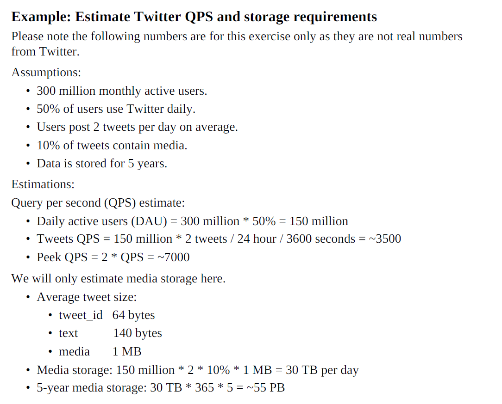

다음은 챕터 2 "BACK-OF-THE-ENVELOPE ESTIMATION"의 요약입니다.

**챕터 2는 시스템 디자인 인터뷰 중에 시스템 용량 및 성능 요구 사항을 추정하는 방법론을 제공하는 데 중점을 둡니다**.

효과적인 간이 추정(back-of-the-envelope estimation)을 위해 몇 가지 핵심 개념을 설명합니다:

- **2의 제곱 (Power of two)**: 분산 시스템에서 데이터 볼륨을 계산하는 데 필수적인 바이트, 킬로바이트(KB), 메가바이트(MB), 기가바이트(GB), 테라바이트(TB), 페타바이트(PB)와 같은 표준 데이터 볼륨 단위를 설명합니다.
- **지연 시간 (Latency numbers)**: 일반적인 컴퓨터 작업의 지연 시간을 제시하며, **메모리 접근은 빠르지만 디스크 접근은 느리다**는 점을 강조합니다. 가능하다면 디스크 탐색을 피하고, 데이터 센터가 다른 지역에 있어 전송 시간이 발생할 수 있으므로 인터넷을 통해 데이터를 전송하기 전에 압축할 것을 권장합니다.
- **가용성 (Availability numbers)**: 고가용성은 시스템이 바람직할 만큼 오랫동안 지속적으로 작동할 수 있는 능력을 의미하며, 백분율(예: 99%, 99.9%)로 측정됩니다. "나인(nines)" 개념은 예상 시스템 다운타임과 관련하여 소개되며, Amazon, Google, Microsoft와 같은 클라우드 제공업체의 서비스 수준 계약(SLA)은 일반적으로 99.9% 이상이라고 언급됩니다.

예시로 **트위터의 QPS(Queries Per Second) 및 스토리지 요구 사항을 추정하는 과정**이 제공됩니다. 이 추정은 일일 활성 사용자 수, 트윗 빈도, 미디어 콘텐츠 비율, 데이터 보존 기간 등의 특정 가정을 기반으로 합니다. 예를 들어, 트윗 QPS는 약 3500으로, 5년간의 미디어 저장 공간은 약 55 PB로 추정됩니다.

챕터는 인터뷰 중에 간이 추정(back-of-the-envelope estimation)을 수행하기 위한 실용적인 조언으로 마무리됩니다:

- **반올림 및 근사치 사용**: 계산을 단순화하기 위해 반올림된 숫자를 사용하는 것을 강조하며, 정밀도는 기대되지 않습니다.
- **가정 기록**: 모든 가정을 기록하는 것이 중요합니다.
- **단위 명확화**: 모호함을 피하기 위해 항상 MB, KB와 같은 단위를 명시해야 합니다.
- **자주 묻는 추정 유형 연습**: QPS, 최대 QPS, 스토리지, 캐시, 서버 수와 같은 자주 묻는 측정 항목에 대한 계산을 연습할 것을 권장합니다.
