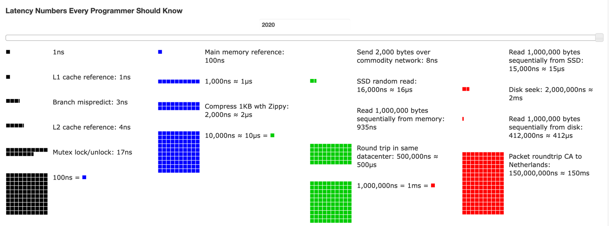

### 목차
- 2의 제곱수
- 모든 프로그래머가 알아야 하는 응답지연 값
- 가용성에 관계된 수치들
- 팁

# 개략적인 규모 추정
- 보편적으로 통용되는 성능 수치상에서 사고 실험을 행하여 추정치를 계산하는 행위로서, 
  어떤 설계가 요구사항에 부합 할것인지 보기 위하 것
- 계략적 규모 추정을 효과적으로 해 내랴면 규모 확장성을 필요한 기본기에 능숙해야 한다.
- 특히, 2의 제곱수나 응답지연값, 그리고 가용성에 괸계된 수치들을 기본적으로 잘이해하고 있어야 한다.

## 2의 제곱수
- 제대로 된 계산 결과를 얻으려면 데이터 볼륨의 단위를 2의 제곱수로 표현하면 어떻게 되는지를 

| 2의 X 제곱 | 근사치   | 이름     | 축약형   |
|:-------:|:-------:|:--------:|:--------:|
|   10    | 1천    | 1키로바이트 | 1KB    |
|   20    | 1백만   | 1메가바이트 | 1MB    |
|   30    | 10억   | 1기가바이트 | 1GB    |
|   40    | 1조    | 1테라바이트 | 1TB    |
|   50    | 1000조 | 1페타바이트 | 1PB    |

## 모든 프로그래머가 알아야 하는 응답지연 값

주요 응답 지연 값:
L1 캐시 참조: 약 0.5ns (나노초)
분기 예측 오류: 약 5ns
L2 캐시 참조: 약 7ns
뮤텍스 락/언락: 약 100ns
주 메모리 참조: 약 100ns
1KB 데이터 압축 (Zippy): 약 1000ns (1마이크로초)
디스크 탐색: 약 10ms (밀리초)
랜덤 데이터 디스크 읽기: 약 200ms
네트워크 (100Mbps) 데이터 전송: 약 10ms
데이터 센터 간 네트워크 (100Mbps) 데이터 전송: 약 100ms 

[출처](https://colin-scott.github.io/personal_website/research/interactive_latency.html)

- 메모리는 빠르지만 디스크는 아직도 느리다.
- 디스크 탐색은 가능한 피하라
- 단순한 압축 알고리즘은 빠르다.
- 데이터를 인터넷으로 전송하기 전에 가능하면 압축하라
- 데이터 센터는 보통 여러 지역에 분산되어 있고, 센터들 간에 데이터를 주고받는 데는 시간이 걸린다.

## 가용성에 관계된 수치들

- 고가용성(high availability)은 시스템이 오랜 시간 동안 지속적으로 중단 없이 운영될 수 있는 능력을 지칭하는 용어다.
- 100%는 시스템이 단 한번도 중단된 적이 없었음을 뜻한다.
- SLA(Service Level Agreement)는 서비스 사업자가 보편적으로 사용하는 언어로, 서비스 사업가 보편적으로 사용하는 용어로
  서비스 사업자와 고객 사이에 맺어진 합의를 의미한다.
  - 이 합의에는 서비스 사업자가 제공하는 서비스의 가용시간이 공식적으로 기술되어 있다. 

|   가용률    | 하루당 장애시간  |  주당 장애시간  | 개월당 장애 시간 | 연간 장애 시간 |
|:--------:|:---------:|:---------:|:---------:|:--------:|
|   99%    |  14.40분   |  1.68시간   |  7.31시간   |  3.65일   |
|  99.9%   |   1.44분   |  10.08분   |  43.83분   |  8.77시간  |
|  99.99%  |   8.64초   |   1.01분   |   4.38분   |  82.60분  |
| 99.999%  | 864.00밀리초 |   6.05초   |  26.30초   |  5.26분   |
| 99.9999% | 86.40밀리초  | 604.80밀리초 |   2.63초   |  31.56초  |

## 예제
가정.
1. 월간 능동 사용자는 3억명이다.
2. 50%의 사용자가 트위터를 매일 사용한다.
3. 평균적으로 각 사용자는 매일 2건의 트윗을 올린다.
4. 미디어를 포함하는 트윗은 10%정도이다.
5. 데이터는 5년간 보관된다.

## 팁
- 가정(assumption)들은 적어두라. 나중에 살펴볼 수 있도록
- 단위(unit)를 붙여라. ex)5KB
- 많이 출제되는 계략적 규모 추정 문제는 QPS, 최대 QPS, 저장소 요구량, 캐시 요구량, 서버 수 등을 추정하는것

